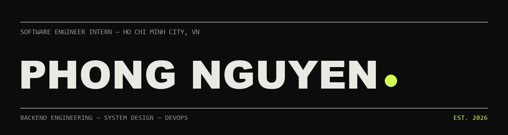

 

 

<table>
  <tr>
    <td>
      
    </td>
    <td>
      
    </td>
    <td>
      
    </td>
    <td>
      
    </td>
  </tr>
</table>

---

## 🚀 About Me

I'm **Nguyen Tran Nam Phong (Thaddeus)** — a **Software Engineer Intern** from 🇻🇳 Ho Chi Minh City, Vietnam. Currently studying at **Sai Gon Technology University**.

- 💻 Building full-stack apps with **React**, **Node.js**, **TypeScript**, and **PostgreSQL**
- 🎨 Experience shipping admin dashboards with **Vue.js**, **Nuxt.js**, and **TailwindCSS**
- 🧩 Interested in scalable systems, clean UI, and solving real product problems
- 🌱 Actively seeking an internship / junior role to grow as an engineer

## 💼 Experience

**Frontend Developer Intern** — Cong Viet Company *(Mar 2026 – May 2026)*
- Built admin dashboard modules (Dashboard, Organization, User, Service Management) with Vue.js / Nuxt.js
- Designed reusable UI components and integrated backend APIs via Axios
- Collaborated with backend engineers in Agile/Scrum sprints

## 🛠️ Tech Arsenal

<table width="100%">
  <tr>
    <td width="50%" valign="top" align="center">
      <h4>💻 Languages & Core</h4>
      
    </td>
    <td width="50%" valign="top" align="center">
      <h4>🎨 Frontend</h4>
      
    </td>
  </tr>
  <tr>
    <td width="50%" valign="top" align="center">
      <h4>⚙️ Backend & Databases</h4>
      
    </td>
    <td width="50%" valign="top" align="center">
      <h4>🛠️ Tools</h4>
      
    </td>
  </tr>
</table>

## 📌 Featured Project

### [PMS — Project Management System](https://github.com/LukaNguyen61004/project-management-system)

Full-stack agile project management platform with Kanban boards, issue tracking, epics, and sprint workflows.

- 50+ REST APIs with Express, TypeScript, Prisma & PostgreSQL
- JWT auth, Google Sign-In, and project-scoped RBAC
- Drag-and-drop Kanban + AI sprint retrospectives (Google Gemini)

  
  

---

## 📊 GitHub Analytics

---

### 💬 Let's Connect!

**I'm open to internship opportunities and interesting conversations.**

 

<table>
  <tr>
    <td>
      
    </td>
    <td>
      
    </td>
    <td>
      
    </td>
  </tr>
</table>

